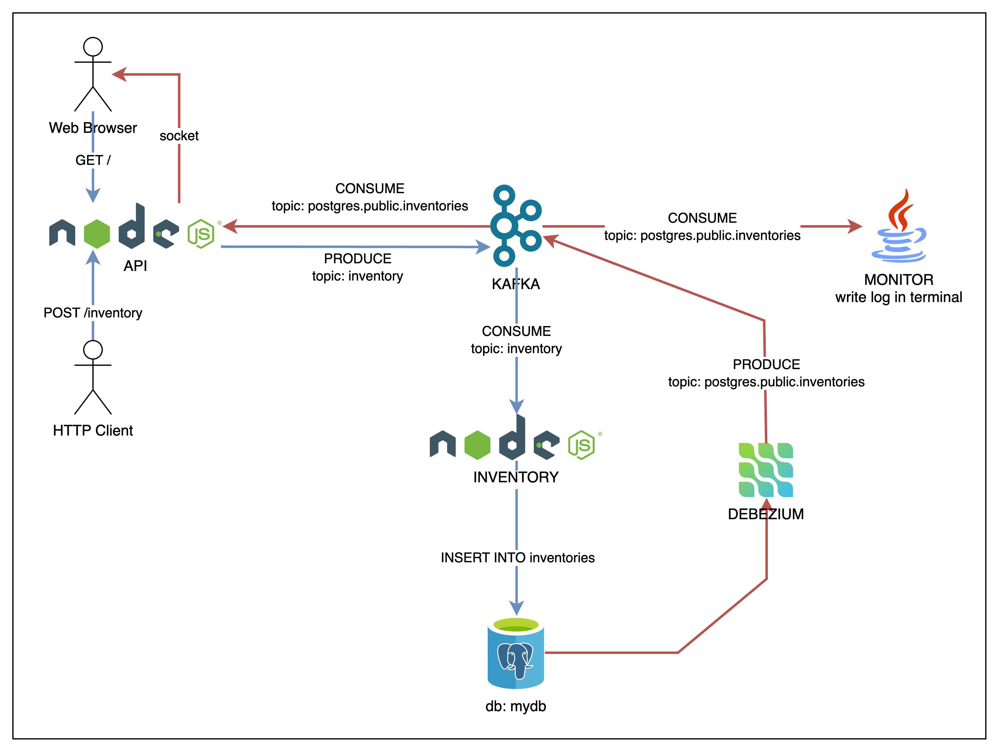

# Systems Integration With Apache Kafka

## Project Architecture

<p align="center">
  
</p>

## Running with docker compose

```bash
docker compose up --build
```

## Making a HTTP Request to API

```bash
curl -XPOST -H "Content-type: application/json" -d '{
  "name": "New Product",
  "description": "Awesome Product",
  "price": 12.43
}' 'http://localhost:3000/inventory'
```


## User Interfaces
- [Debezium UI - Manage connectors](http://localhost:8084)
- [Redpanda - Monitor kafka topics](http://localhost:8081)

## References
- [Debezium](https://debezium.io/documentation/reference/stable/connectors/postgresql.html)