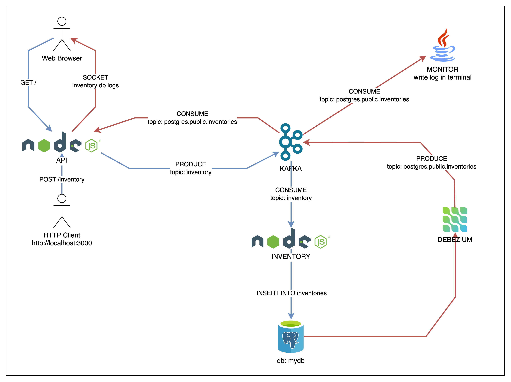

# Systems Integration With Apache Kafka

## Introduction

This project is a simple example of how to integrate systems using Apache Kafka. It's based on three main applications:

- [api](./apps/api/): A server that receive `POST` messages to create new products by sending a message to a Kafka topic. This application also have a UI to monitor the updates in the Postgres database.
- [inventory](./apps/inventory/): A Kafka consumer that consumes messages from a Kafka topic and updates the product inventory in Postgres.
- [monitor](./apps/monitor/): A Java application that consumes messages from a Kafka topic and prints in the console.

The communication between the applications is made through Kafka. The `api` application is a Kafka producer that sends message to `inventory` Kafka topic. It also consumes messages from the `postgres.public.inventories` topic to monitor the updates in the Postgres database in a user interface. It is using a Debezium connector to sync the Postgres data to Kafka.

The `inventory` application is a Kafka consumer that consumes messages from the `inventory` Kafka topic and updates the product inventory in Postgres.

Finally, the `monitor` application is a simple Java application that consumes messages from the `postgres.public.inventories` Kafka topic and logs the database changes in the console.

### Project Architecture

<p align="center">
  
</p>

## Running the project

### Running with docker compose

```bash
docker compose up --build
```

### Making a HTTP Request to API

Once all the applications are running properly, you can make a HTTP POST request to the `api` application to create a new product:

```bash
curl -XPOST -H "Content-type: application/json" -d '{
  "name": "New Product",
  "description": "Awesome Product",
  "price": 12.43
}' 'http://localhost:3000/inventory'
```

### Monitoring the database changes

Access [http://localhost:3000](http://localhost:3000) in your browser to see the changes in the database.

## User Interfaces
- [Inventory Monitor](http://localhost:3000)
- [Debezium UI - Manage Kafka connectors](http://localhost:8084)
- [Redpanda - Monitor Kafka topics](http://localhost:8081)

## References

### Event Streaming
- [Apache Kafka](https://kafka.apache.org/)
- [Debezium](https://debezium.io/documentation/reference/stable/connectors/postgresql.html)
- [Redpanda](https://redpanda.com/)

### Database
- [Postgres](https://www.postgresql.org/)
- [DBeaver](https://dbeaver.io/)

### Node.js
- [Node.js](https://nodejs.org/)
- [Express framework](https://expressjs.com)
- [EJS - Embedded JavaScript templates](https://ejs.co/)

### Java
- [Spring Boot](https://spring.io/projects/spring-boot)
- [Spring Initializr](https://start.spring.io/)